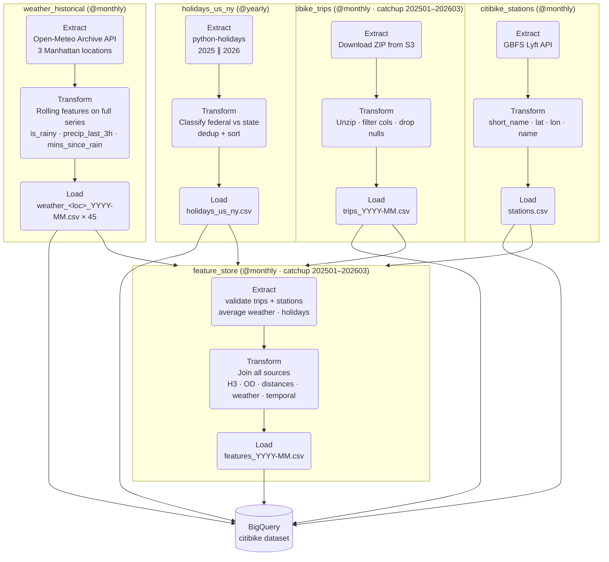
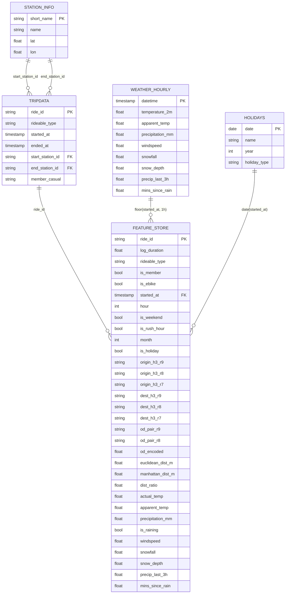

# IS3107 Citibike Pipeline

ETLT pipeline built with Apache Airflow to collect, engineer, and stage data for a Citibike demand analysis project targeting XGBoost model training. Data is staged as CSV files locally before loading into BigQuery.

# Team

| Name         | GitHub                                       |
| ------------ | -------------------------------------------- |
| Beverley Teo | [@bevteo](https://github.com/bevteo)         |
| Nathan Kew   | [@nathankkh](https://github.com/nathankkh)   |
| Nicholas Lee | [@niclee1219](https://github.com/niclee1219) |
| Terri Tan    | [@territxl](https://github.com/territxl)     |

# Airflow & Data Pipeline
## Data Sources

| Source                                                                                                                           | DAG                  | Description                                                                               |
| -------------------------------------------------------------------------------------------------------------------------------- | -------------------- | ----------------------------------------------------------------------------------------- |
| [Citibike S3 (Lyft)](https://s3.amazonaws.com/tripdata/index.html)                                                               | `citibike_trips`     | Monthly trip ZIPs covering Jan 2025 – Mar 2026                                            |
| [GBFS Lyft API](https://gbfs.lyft.com/gbfs/2.3/bkn/en/station_information.json)                                                  | `citibike_stations`  | Live station reference data (short_name, lat, lon, name)                                  |
| [Open-Meteo Archive API](<https://open-meteo.com/en/docs/historical-weather-api#:~:text=Download%20CSV-,API%20URL,-(Open%20in)>) | `weather_historical` | Hourly historical weather for 3 Manhattan locations (Harlem, Midtown, Financial District) |
| [python-holidays](https://github.com/vacanza/python-holidays)                                                                    | `holidays_us_ny`     | US federal and NY state holidays for 2025–2026                                            |

## Pipeline Architecture



## Entity Relationship



## DAG Reference

| DAG                  | Schedule   | Pattern | Output                                      |
| -------------------- | ---------- | ------- | ------------------------------------------- |
| `weather_historical` | `@monthly` | ETLT    | `output/weather/weather_<loc>_YYYY-MM.csv`  |
| `holidays_us_ny`     | `@yearly`  | ETL     | `output/holidays/holidays_us_ny.csv`        |
| `citibike_stations`  | `@weekly`  | ETL     | `output/citibike_stations/stations.csv`     |
| `citibike_trips`     | `@monthly` | ETLT    | `output/citibike_trips/trips_YYYY-MM.csv`   |
| `feature_store`      | `@monthly` | ETL     | `output/feature_store/features_YYYY-MM.csv` |

## Setup

### 1. Clone repo

```bash
git clone https://github.com/niclee1219/IS3107_citibike.git && cd IS3107_citibike
```

### 2. Install dependencies

```bash
pip install apache-airflow
pip install -r requirements.txt
```

### 3. Point Airflow at this project's DAGs folder

```bash
export AIRFLOW__CORE__DAGS_FOLDER=$(pwd)/dags
export AIRFLOW__CORE__LOAD_EXAMPLES=False
```

### 4. Install the Google Cloud CLI

Follow the official install guide for your OS: https://cloud.google.com/sdk/docs/install-sdk

macOS (Homebrew):

```bash
brew install --cask google-cloud-sdk
```

After installing, initialise the CLI:

```bash
gcloud init
```

### 5. Set up Application Default Credentials (ADC)

Full guide: https://cloud.google.com/docs/authentication/set-up-adc-local-dev-environment

```bash
gcloud auth application-default login
```

### 6. Run DAGs in order

```bash
airflow standalone
```

Trigger in this order (`feature_store` depends on all others):

1. `citibike_stations` — station reference data (needed before trips & features)
2. `weather_historical` — historical weather with rolling features (run once)
3. `holidays_us_ny` — holiday calendar (run once)
4. `citibike_trips` — enable the DAG; catchup auto-backfills 202501–202603
5. `feature_store` — enable after trips completes; catchup auto-backfills 202501–202603

## Output Structure

```
output/
├── weather/
│   ├── weather_harlem_2025-01.csv          # ~744 rows per file
│   ├── weather_midtown_2025-01.csv
│   ├── weather_financial_district_2025-01.csv
│   └── ...                                 # ×45 files (3 locations × 15 months)
├── holidays/
│   └── holidays_us_ny.csv                  # US federal + NY state, 2025–2026
├── citibike_stations/
│   └── stations.csv                        # short_name / name / lat / lon
├── citibike_trips/
│   ├── trips_2025-01.csv
│   └── ...                                 # one file per month through 2026-03
└── feature_store/
    ├── features_2025-01.csv
    └── ...                                 # one file per month through 2026-03
```

## Feature Engineering Notes

### Weather

Rolling features computed across the **full 15-month time series** per location before splitting into monthly files — ensures accuracy at month boundaries.

| Column                    | Description                                               |
| ------------------------- | --------------------------------------------------------- |
| `is_rainy` / `is_raining` | `True` when `precipitation_mm > 0.1`                      |
| `precip_last_3h`          | Sum of precipitation in the 3 hours before this row       |
| `mins_since_rain`         | Minutes since the last hour with measurable precipitation |

### Spatial (H3)

Uses [Uber H3](https://github.com/uber/h3) hexagonal indexing at three resolutions:

| Resolution | Avg hex size | Use                      |
| ---------- | ------------ | ------------------------ |
| r9         | ~174 m       | Fine-grained pickup zone |
| r8         | ~461 m       | Station neighbourhood    |
| r7         | ~1.2 km      | District-level demand    |

OD pairs are encoded with a deterministic MD5 hash so the same origin-destination always maps to the same float across monthly batches.

### Distances

- **Euclidean** (`euclidean_dist_m`): haversine great-circle distance between start and end stations
- **Manhattan** (`manhattan_dist_m`): sum of north-south leg + east-west leg haversine distances
- **Ratio** (`dist_ratio`): euclidean / manhattan — values near 1.0 mean the route is direct


# Visualisations & Streamlit

## Setup
> Pre-requisites:
> - Required packages have been installed as per the Airflow setup steps
> - Google Application Default Credentials have been setup

## Run

```bash
streamlit run streamlit-app/app.py
```
